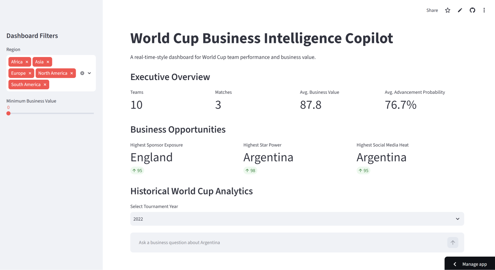
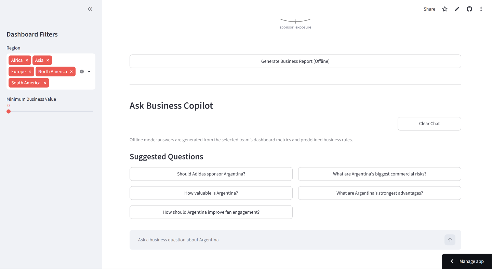
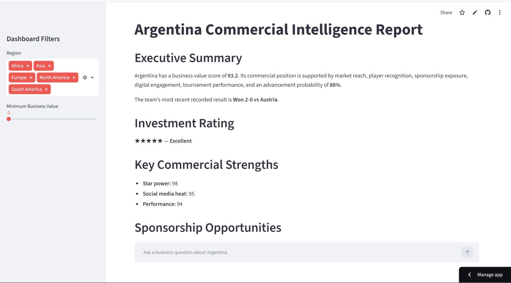
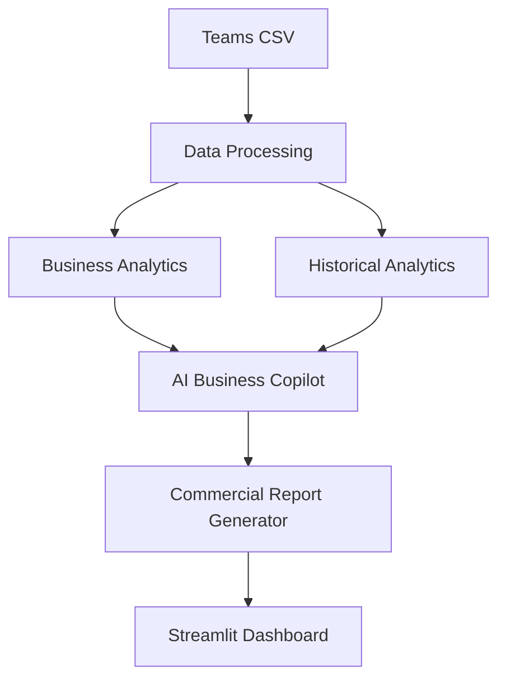

# ⚽ World Cup Business Intelligence Copilot


An AI-powered business intelligence platform for evaluating FIFA World Cup teams based on commercial value, sponsorship opportunities, historical performance, and AI-generated business insights.

---

## 🚀 Live Demo

🌐 **Streamlit App**

https://worldcup-business-copilot-xwetqs4solcofyvkds9fkn.streamlit.app

📂 **GitHub Repository**

https://github.com/TonyCurlymoe/worldcup-business-copilot

---

# 📖 Project Overview

World Cup Business Intelligence Copilot is an interactive analytics platform designed to evaluate FIFA World Cup teams from a commercial perspective rather than purely competitive performance.

The application combines structured team data, historical World Cup results, business value indicators, and AI-generated recommendations into a single business intelligence dashboard.

Users can explore sponsorship opportunities, compare commercial strengths, generate executive business reports, and analyze historical tournament trends.

To improve reliability, the application supports both:

- OpenAI-powered AI analysis
- Offline business rule fallback mode (when an API key is unavailable)

This allows the application to remain fully functional even without an active AI connection.

---

# ✨ Features

### 📊 Interactive Dashboard

- Executive business overview
- Commercial value ranking
- Business opportunity identification
- Radar chart visualization
- Historical World Cup analytics

---

### 🤖 AI Business Copilot

- Ask commercial questions about any team
- AI-generated sponsorship recommendations
- Commercial risk analysis
- Fan engagement insights
- Automatic offline fallback mode

---

### 📄 Business Report

Generate executive-style commercial reports including:

- Executive Summary
- Investment Rating
- Commercial Strengths
- Sponsorship Opportunities
- Business Risks
- Historical Performance

---

### 📈 Historical Analytics

Analyze previous FIFA World Cups with:

- Tournament filtering
- Historical match statistics
- Team performance trends

---

# 📸 Dashboard Preview

## Dashboard



---

## Business Copilot



---

## Business Report



---

# 🏗️ System Architecture



---

# 📁 Project Structure

```text
worldcup-business-copilot/
│
├── app.py
├── README.md
├── requirements.txt
├── LICENSE
│
├── config/
│
├── data/
│   ├── teams.csv
│   └── historical_world_cup.csv
│
├── images/
│   ├── dashboard.png
│   ├── copilot.png
│   └── report.png
│
├── src/
│   └── worldcup_business_copilot/
│       ├── analytics.py
│       ├── business_value.py
│       ├── config.py
│       ├── data.py
│       ├── llm.py
│       ├── worldcup_api.py
│       └── app.py
│
└── tests/
```

---

# ⚙️ Installation

Clone the repository

```bash
git clone https://github.com/TonyCurlymoe/worldcup-business-copilot.git

cd worldcup-business-copilot
```

Create a virtual environment

```bash
python -m venv .venv
```

Activate it

Windows PowerShell

```powershell
.venv\Scripts\activate
```

Install dependencies

```bash
pip install -r requirements.txt
```

Create your environment file

```bash
copy .env.example .env
```

Run the application

```bash
streamlit run app.py
```

---

# 🔑 Environment Variables

To enable AI-generated business recommendations, configure your OpenAI API key inside:

```
.env
```

Example:

```env
OPENAI_API_KEY=your_api_key_here
OPENAI_MODEL=gpt-4o-mini
```

If no API key is provided, the application automatically switches to Offline Mode.

---

# 🛠 Tech Stack

| Category | Technology |
|-----------|------------|
| Language | Python |
| Dashboard | Streamlit |
| Visualization | Plotly |
| Data Analysis | Pandas |
| AI | OpenAI API |
| Version Control | Git |
| Repository | GitHub |
| Deployment | Streamlit Community Cloud |

---

# 💼 Business Use Cases

This project demonstrates how AI can support commercial decision-making in sports organizations.

Example use cases include:

- Sponsorship evaluation
- Brand exposure analysis
- Commercial opportunity assessment
- Investment decision support
- Executive reporting
- Fan engagement analysis

---

# 🚀 Future Improvements

Planned features for Version 2.0 include:

- Team-to-team comparison
- Live FIFA API integration
- AI sponsorship recommendation engine
- PDF report export
- User authentication
- Database integration
- Retrieval-Augmented Generation (RAG)
- Interactive business forecasting
- Multi-language support

---

# 📦 Version

Current Release

**Version 1.0.0**

Released on GitHub Releases.

---

# 👤 Author

**Wei Che**

GitHub:

https://github.com/TonyCurlymoe

---

# 📄 License

This project is licensed under the MIT License.
