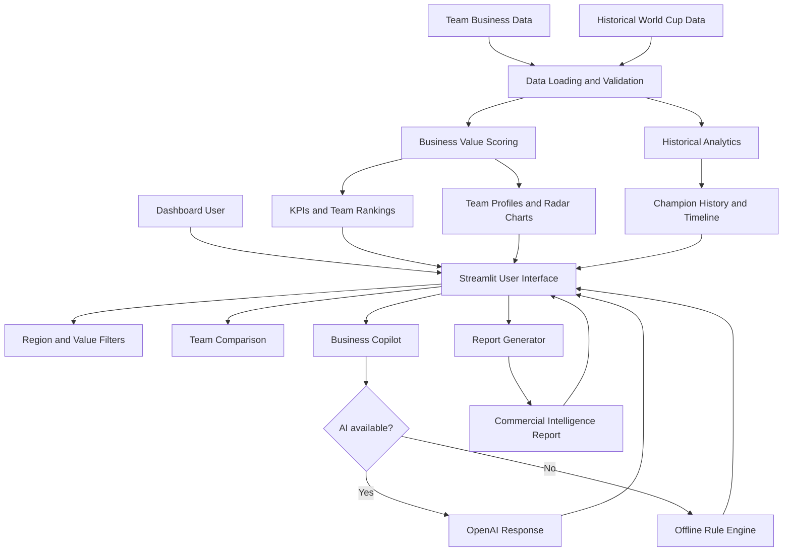
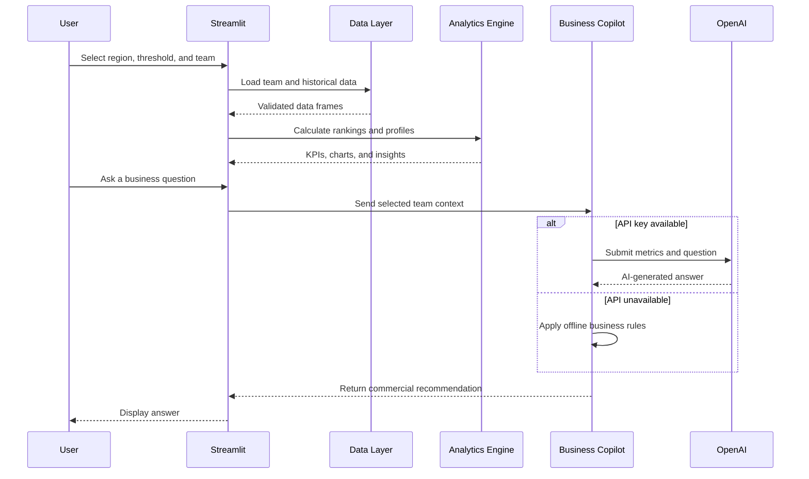

# ⚽ World Cup Business Intelligence Copilot

<p align="center">
  <strong>
    An AI-assisted business intelligence dashboard for evaluating FIFA World Cup teams,
    sponsorship opportunities, commercial value, and historical tournament performance.
  </strong>
</p>

<p align="center">
  <a href="https://worldcup-business-copilot-xwetqs4solcofyvkds9fkn.streamlit.app">
    
  </a>
  <a href="https://github.com/TonyCurlymoe/worldcup-business-copilot/releases/tag/v1.0.0">
    
  </a>
  
  
  
  <a href="LICENSE">
    
  </a>
</p>

<p align="center">
  <a href="https://worldcup-business-copilot-xwetqs4solcofyvkds9fkn.streamlit.app"><strong>Open Live Demo</strong></a>
  ·
  <a href="https://github.com/TonyCurlymoe/worldcup-business-copilot/releases/tag/v1.0.0"><strong>View Release</strong></a>
  ·
  <a href="https://github.com/TonyCurlymoe/worldcup-business-copilot"><strong>GitHub Repository</strong></a>
</p>

---

## Table of Contents

- [Executive Summary](#executive-summary)
- [Why This Project Matters](#why-this-project-matters)
- [Business Problem](#business-problem)
- [Key Capabilities](#key-capabilities)
- [Application Preview](#application-preview)
- [How the Business Value Model Works](#how-the-business-value-model-works)
- [System Architecture](#system-architecture)
- [Data and AI Workflow](#data-and-ai-workflow)
- [AI and Offline Modes](#ai-and-offline-modes)
- [Business Questions Supported](#business-questions-supported)
- [Technology Stack](#technology-stack)
- [Project Structure](#project-structure)
- [Installation](#installation)
- [Configuration](#configuration)
- [Testing the Application](#testing-the-application)
- [Deployment](#deployment)
- [Current Limitations](#current-limitations)
- [Roadmap](#roadmap)
- [Development Journey](#development-journey)
- [Skills Demonstrated](#skills-demonstrated)
- [Release Information](#release-information)
- [Author](#author)
- [License](#license)

---

## Executive Summary

The **World Cup Business Intelligence Copilot** is an interactive analytics application that evaluates FIFA World Cup teams from a commercial and business perspective.

Traditional sports dashboards usually focus on match outcomes, goals, rankings, and athletic performance. This project extends the analysis by asking a different set of questions:

- Which teams offer the strongest sponsorship opportunities?
- Which teams have the greatest commercial value?
- Which business factors drive each team's market attractiveness?
- What risks should sponsors or investors consider?
- How can historical tournament performance support commercial analysis?

The application combines team-level business indicators, historical World Cup data, interactive visualizations, automated commercial reports, and an AI-assisted business question interface.

It is deployed publicly through Streamlit Community Cloud and can operate with or without an OpenAI API key.

---

## Why This Project Matters

Sports organizations, sponsors, consulting teams, and commercial partners often need to evaluate more than athletic performance.

A high-performing team may not always create the strongest sponsorship opportunity. Commercial value can also depend on:

- Market reach
- Star recognition
- Sponsor visibility
- Social media interest
- Recent performance
- Probability of tournament advancement

This project demonstrates how business intelligence and AI can convert those indicators into a decision-support dashboard for sponsorship and commercial strategy.

---

## Business Problem

### Core question

> How can structured sports and commercial data help decision-makers evaluate the business potential of World Cup teams?

### Target users

The dashboard is designed as a prototype for:

- Sports marketing analysts
- Sponsorship managers
- Business intelligence analysts
- Brand strategy teams
- Sports consulting firms
- Commercial investors
- Tournament organizers

### Decisions supported

The application can assist users with:

- Comparing team commercial profiles
- Identifying strong sponsorship candidates
- Evaluating business risks
- Understanding value drivers
- Exploring historical tournament results
- Generating executive-level commercial summaries

---

## Key Capabilities

### 📊 Executive Dashboard

The main dashboard presents:

- Number of selected teams
- Number of relevant match results
- Average business value
- Average advancement probability
- Leading sponsorship opportunities
- Team business value rankings

Users can filter teams by region and minimum business value.

---

### 💼 Business Opportunity Analysis

The dashboard identifies teams with the highest:

- Sponsor exposure
- Star power
- Social media interest

These metrics help highlight teams that may be attractive to global brands and commercial partners.

---

### 📈 Team Business Profiles

Each team profile includes:

- Business value score
- Sponsor exposure
- Advancement probability
- Key commercial strengths
- Business insights
- Recommended sponsorship sectors
- Commercial risk level
- Radar chart of value drivers

---

### ⚖️ Team Comparison

Users can compare two teams across metrics such as:

- Business value
- Market size
- Star power
- Social media heat
- Sponsor exposure
- Performance score
- Advancement probability

The application also provides a concise interpretation of which team has the stronger overall commercial profile.

---

### 🌍 Historical World Cup Analytics

The historical section includes:

- Tournament-year selection
- Champion identification
- Final-match results
- Championship history
- World Cup champion timeline

Historical data helps provide context for long-term team reputation and tournament success.

---

### 🤖 Business Copilot

The Business Copilot answers questions about the selected team.

It can provide:

- Sponsorship recommendations
- Commercial value explanations
- Risk assessments
- Fan-engagement recommendations
- Investment guidance
- Strength analysis

Suggested questions make the feature easy to demonstrate without requiring users to design their own prompts.

---

### 📄 Commercial Intelligence Report

Users can generate an executive-style report containing:

- Executive summary
- Investment rating
- Key commercial strengths
- Sponsorship opportunities
- Commercial risks
- Recommended action

The report can also be downloaded as a Markdown file.

---

## Application Preview

### Executive Dashboard


The dashboard summarizes team value, business opportunities, historical analytics, and interactive filters.

---

### Business Copilot


The Business Copilot answers commercial questions using the selected team's dashboard metrics and predefined business logic, with optional OpenAI support.

---

### Commercial Intelligence Report


The report generator converts team-level metrics into a structured executive business assessment.

---

## How the Business Value Model Works

The application calculates a composite business value score using several team-level indicators.

### Current value drivers

| Metric | Business interpretation |
|---|---|
| Market size | Potential commercial audience and market reach |
| Star power | Player recognition and endorsement potential |
| Social media heat | Digital interest and fan-engagement potential |
| Sponsor exposure | Brand visibility and sponsorship attractiveness |
| Performance score | Competitive strength and reputation |
| Advancement probability | Expected continued tournament exposure |

The score is implemented as a transparent weighted scoring model in the application code.

This approach was selected because it is:

- Easy to explain to nontechnical users
- Auditable
- Fast enough for an interactive dashboard
- Suitable for an early-stage business intelligence prototype

> The current business value score is a demonstration model based on curated sample indicators. It should not be interpreted as an official market valuation.

---

## System Architecture



---

## Data and AI Workflow



---

## AI and Offline Modes

The project supports two operating modes.

### OpenAI mode

When a valid API key is configured, the Business Copilot can use an OpenAI model to produce a more flexible natural-language response.

The model receives only the selected team's structured business context and the user's question.

### Offline mode

When an API key is missing or an external AI request fails, the system automatically uses a rule-based fallback.

Offline mode supports common question categories, including:

- Sponsorship
- Commercial value
- Business risks
- Fan engagement
- Investment
- Team strengths

### Why the fallback matters

The fallback design improves:

- Reliability
- Demo availability
- Cost control
- Privacy
- Development flexibility

It also ensures that the public application remains usable without exposing a private API key.

---

## Business Questions Supported

Examples include:

- Should Adidas sponsor France?
- How valuable is Argentina?
- What are England's biggest commercial risks?
- What are Brazil's strongest business advantages?
- How should Japan improve fan engagement?
- Is Spain a strong commercial investment?
- Which metrics create the most value for a selected team?

The offline engine recognizes major business topics and generates responses using the selected team's current metrics.

---

## Technology Stack

| Category | Technology |
|---|---|
| Programming language | Python |
| Web application | Streamlit |
| Data manipulation | Pandas |
| Visualization | Plotly |
| AI integration | OpenAI API, optional |
| Configuration | python-dotenv |
| Version control | Git and GitHub |
| Deployment | Streamlit Community Cloud |
| Documentation | Markdown and Mermaid |
| License | MIT |

---

## Project Structure

```text
worldcup-business-copilot/
│
├── app.py
├── README.md
├── LICENSE
├── requirements.txt
├── pyproject.toml
├── Dockerfile
├── docker-compose.yml
├── .env.example
├── .gitignore
│
├── config/
│
├── data/
│   ├── teams.csv
│   └── historical_world_cup.csv
│
├── images/
│   ├── dashboard.png
│   ├── copilot.png
│   └── report.png
│
├── src/
│   └── worldcup_business_copilot/
│       ├── __init__.py
│       ├── analytics.py
│       ├── app.py
│       ├── business_value.py
│       ├── config.py
│       ├── data.py
│       ├── llm.py
│       └── worldcup_api.py
│
└── tests/
```

### Main modules

| Module | Responsibility |
|---|---|
| `app.py` | Root Streamlit entry point |
| `src/.../app.py` | Main dashboard interface and interaction logic |
| `data.py` | CSV loading and team-profile retrieval |
| `business_value.py` | Business value calculations |
| `analytics.py` | Business summaries and team-strength analysis |
| `llm.py` | Report generation, offline Q&A, and optional AI responses |
| `config.py` | Environment variables and application settings |
| `worldcup_api.py` | Match-data retrieval interface |

---

## Installation

### 1. Clone the repository

```bash
git clone https://github.com/TonyCurlymoe/worldcup-business-copilot.git
cd worldcup-business-copilot
```

### 2. Create a virtual environment

```bash
python -m venv .venv
```

### 3. Activate the environment

#### Windows PowerShell

```powershell
.venv\Scripts\Activate.ps1
```

#### Windows Command Prompt

```cmd
.venv\Scripts\activate
```

#### macOS or Linux

```bash
source .venv/bin/activate
```

### 4. Install dependencies

```bash
python -m pip install --upgrade pip
pip install -r requirements.txt
```

### 5. Create the local environment file

#### Windows

```powershell
Copy-Item .env.example .env
```

#### macOS or Linux

```bash
cp .env.example .env
```

### 6. Run the application

```bash
python -m streamlit run app.py
```

The local application should open at:

```text
http://localhost:8501
```

A different port can be specified when needed:

```bash
python -m streamlit run app.py --server.port 8502
```

---

## Configuration

The `.env.example` file should contain placeholder values only:

```env
OPENAI_API_KEY=
OPENAI_MODEL=gpt-4o-mini
TEAM_DATA_PATH=data/teams.csv
HISTORICAL_DATA_PATH=data/historical_world_cup.csv
```

Create a private `.env` file for local use.

### Important security note

Never commit a real API key.

The repository's `.gitignore` should include:

```gitignore
.env
.streamlit/secrets.toml
```

The public application can operate in offline mode without an OpenAI key.

---

## Testing the Application

Before committing major changes, the following checks are recommended.

### Check module imports

```bash
python -c "from src.worldcup_business_copilot.llm import answer_business_question, answer_business_question_with_ai, generate_ai_report; print('IMPORT OK')"
```

### Check configuration

```bash
python -c "from src.worldcup_business_copilot.config import settings; print('AI enabled:', settings.ai_enabled); print('Model:', settings.openai_model)"
```

### Run Streamlit locally

```bash
python -m streamlit run app.py
```

### Manual feature checks

Confirm that:

- Region filtering updates team results
- Minimum business value filtering works
- Match results reflect selected teams
- Team comparison updates correctly
- Historical tournament selection works
- Suggested questions produce responses
- Clear Chat removes conversation history
- Report generation works
- Report download works
- Offline fallback works without an API key

---

## Deployment

The application is deployed through Streamlit Community Cloud.

### Deployment configuration

| Setting | Value |
|---|---|
| Repository | `TonyCurlymoe/worldcup-business-copilot` |
| Branch | `main` |
| Main file | `app.py` |
| Public URL | Streamlit Community Cloud app |

Changes pushed to the `main` branch can trigger a new deployment.

### Live application

[Open the World Cup Business Intelligence Copilot](https://worldcup-business-copilot-xwetqs4solcofyvkds9fkn.streamlit.app)

---

## Current Limitations

This project is a portfolio-oriented MVP and currently has several limitations:

- Team business indicators are curated sample values
- The scoring weights are analytical assumptions rather than official valuations
- Historical analysis is based on the included local dataset
- Match data may use local or demonstration records rather than a guaranteed live provider
- Offline responses rely on predefined business rules
- AI responses depend on API availability, configuration, quota, and provider access
- The application does not currently include authentication or persistent user accounts
- Chat history is session-based rather than stored in a database
- Reports are downloaded as Markdown rather than PDF

These limitations are documented to distinguish demonstrated functionality from future production requirements.

---

## Roadmap

### Version 1.0 — Completed

- Interactive Streamlit dashboard
- Region and business value filters
- Executive KPIs
- Business opportunity indicators
- Team value ranking
- Historical World Cup analytics
- Champion history visualization
- Tournament timeline
- Team comparison
- Team business profiles
- Radar charts
- Commercial insight rules
- Business report generation
- Markdown report download
- Business Copilot
- Suggested questions
- Clear Chat function
- Offline fallback mode
- Optional OpenAI integration
- Streamlit Community Cloud deployment
- GitHub release and MIT License

### Version 1.1 — Quality improvements

- Expand automated tests
- Improve error messages
- Add data-schema validation
- Replace deprecated Streamlit arguments
- Improve mobile responsiveness
- Add loading and data-source indicators
- Refine accessibility and chart labels

### Version 2.0 — Planned analytics expansion

- Larger World Cup historical dataset
- Improved team-to-team benchmarking
- Configurable business value weights
- Brand-specific sponsorship recommendations
- Sponsorship-fit scoring
- Scenario analysis
- Commercial trend visualization
- Exportable PDF reports

### Version 3.0 — Future platform vision

- Reliable real-time match-data provider
- Database-backed application data
- User authentication
- Saved analyses and reports
- Retrieval-Augmented Generation knowledge base
- Multi-language interface
- Forecasting and sponsorship ROI models
- Administrative data-management interface

---

## Development Journey

This project developed through several stages.

### Stage 1: Business concept

The initial goal was to create a World Cup dashboard that connected sports performance with business value.

The project was intentionally designed to go beyond standard match statistics.

### Stage 2: Dashboard MVP

The first version introduced:

- Team data
- Business value scoring
- Regional filtering
- Rankings
- Basic visualizations

### Stage 3: Historical analytics

Historical World Cup finals and champion data were added to provide long-term tournament context.

### Stage 4: Commercial intelligence

The application was expanded with:

- Business opportunities
- Team profiles
- Value drivers
- Risk categories
- Sponsorship sectors

### Stage 5: Business Copilot

A rule-based question interface was added so users could request commercial recommendations in natural language.

### Stage 6: Optional AI integration

The Copilot was extended with optional OpenAI support while preserving the local fallback engine.

### Stage 7: Deployment and documentation

The project was:

- Published on GitHub
- Deployed to Streamlit Community Cloud
- Documented with screenshots
- Released as version `v1.0.0`
- Licensed under the MIT License

---

## Skills Demonstrated

### Business analytics

- Translating business requirements into measurable indicators
- Designing a composite value score
- Identifying commercial strengths and risks
- Producing decision-focused recommendations

### Data analytics

- Loading and transforming CSV data
- Filtering and aggregating data with Pandas
- Building team rankings and KPI summaries
- Integrating current and historical datasets

### Visualization

- Bar charts
- Comparative charts
- Radar charts
- Historical timelines
- Interactive Streamlit components

### AI application development

- Prompt construction
- Structured context injection
- External API integration
- Graceful AI fallback
- Natural-language business Q&A

### Software engineering

- Modular Python package structure
- Environment-based configuration
- Git version control
- Dependency management
- Cloud deployment
- Release management
- Documentation and licensing

---

## Portfolio Summary

This project demonstrates the ability to connect:

```text
Business problem
      +
Data analytics
      +
Interactive visualization
      +
AI-assisted recommendations
      +
Cloud deployment
```

The result is a complete end-to-end portfolio application rather than an isolated notebook or static analysis.

---

## Release Information

### Current release

**Version 1.0.0 — World Cup Business Intelligence Copilot**

The initial public release includes:

- Interactive dashboard
- Business value analytics
- AI Business Copilot
- Offline fallback mode
- Commercial report generation
- Historical World Cup analytics
- Streamlit Cloud deployment

[View the v1.0.0 release](https://github.com/TonyCurlymoe/worldcup-business-copilot/releases/tag/v1.0.0)

---

## Author

**Wei Che**

Business Analytics graduate student at San Francisco State University.

This project was created as a portfolio demonstration of business intelligence, data analytics, AI integration, and cloud deployment.

- GitHub: [TonyCurlymoe](https://github.com/TonyCurlymoe)
- Live demo: [World Cup Business Intelligence Copilot](https://worldcup-business-copilot-xwetqs4solcofyvkds9fkn.streamlit.app)

---

## Acknowledgements

This project uses:

- [Python](https://www.python.org/)
- [Streamlit](https://streamlit.io/)
- [Pandas](https://pandas.pydata.org/)
- [Plotly](https://plotly.com/python/)
- [OpenAI](https://openai.com/)
- [GitHub](https://github.com/)

FIFA and World Cup-related names are used only to describe the analytical subject of this educational portfolio project. This repository is not affiliated with or endorsed by FIFA.

---

## License

This project is licensed under the [MIT License](LICENSE).

Copyright © 2026 Wei Che.
